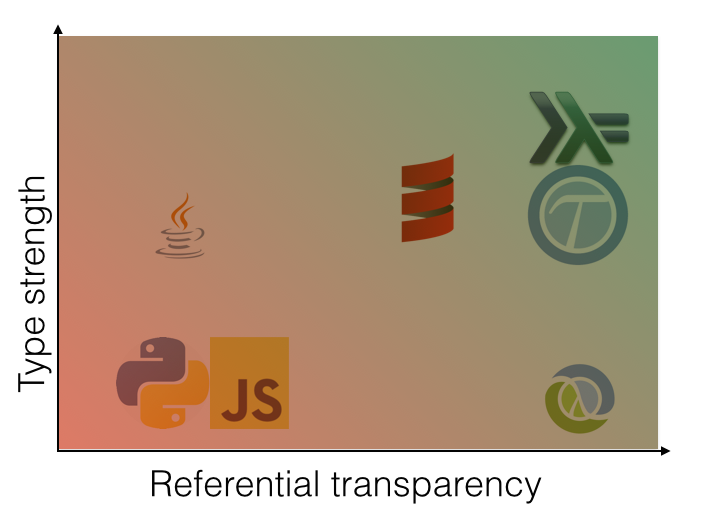

# [lens pun goes here]


an exploration of <strike>strong</strike> <strike>gradual</strike>  _appropriate_ typing


### Acyclic LLC


acyc.lc

        Peter Fraenkel
             @podsnap
          pnf@podsnap.com
         blog.podsnap.com


### Foci

* Language wars.
* What/why are lenses?
* Lenses and type.
* Intro to ```core.typed```.
* Lenses with core.typed.
* Van Laarhoven lenses.		 [eviscerate]
* What is best?


### How do you find your bugs?

1. Production failure
2. Test failure
3. Compilation errors 
4. In the REPL
5. Squiggly red lines


### delayed pain




### Two virtues

* Referential transparency and strong typing both make certain bugs unlikely.
* Both make you think.
* Neither of them is binary.
* Embracing one but not the other seems arbitrary [to me].


### TL;DR

* Clojure can have both RT (built in) and ST (via ```core.typed```),
* but it isn't Haskell,
* and monads aren't a natural fit,
* but macros are (which turns out to be important).


### What are lenses?

* Essentially: a tool for convenient access to fields of nested structures, especially immutable ones.
* Originally: something fancy about bidirectional programming.
* Standard example:
~~~.scala
    case class Point(x: Double, y: Double)
    case class Color(r: Byte, g: Byte, b: Byte)
    case class Turtle(position: Point, heading: Double, color: Color)
~~~
* Standard example:
~~~.clj
    (defrecord Point [^double x ^double y])
    (defrecord Color [^short r ^short g ^short b])
    (defrecord Turtle [^Point position ^double heading ^Color color])
    (def t (->Turtle (->Point 1.0 2.0) (/ Math/PI 4) (->Color 255 0 0)))
~~~
* <!-- .element: class="fragment" data-fragment-index="1" --> So what?  We have ```assoc-in``` and ```get-in``` 


### AWS


### AWS

Java is the "Kingdom of Nouns"

~~~.java
RequestSpotInstancesRequest
   requestSpotInstancesRequest = new RequestSpotInstancesRequest();
LaunchSpecification
   launchSpecification = new LaunchSpecification();
InstanceNetworkInterfaceSpecification
   networkInterface = new InstanceNetworkInterfaceSpecification();
List<InstanceNetworkInterfaceSpecification>
   networkInterfaces = new ArrayList<InstanceNetworkInterfaceSpecification>();

networkInterface.setSubNetId("subnet-whatever")
netWorkInterfaces.add(networkInterface);
launchSpecification.setNetworkInterfaces(networkInterfaces);
requestSpotInstancesRequest.setLaunchSpecification(launchSpecification);

RequestSpotInstancesResult spotInstancesResult = requestSpotInstances(requestSpotInstanceRequests);
~~~


### AWS / amazonica

* Much nicer:
~~~.clj
{:spot-price 0.01, 
   :instance-count 1, 
   :type "one-time", 
   :launch-specification
   {:image-id "ami-something",
    :instance-type "t1.micro",
    :placement  {:availability-zone "us-east-1a"},
    :key-name "your-key"
    :user-data "WWFua2VlIGRvb2RsZSB3ZW50IHRvIHRvd24gcmlkaW5nIG9uIGEgcG9ueQo="
    :network-interfaces
    [{:device-index 0
      :subnet-id "subnet-yowsa"
      :groups ["sg-hubba"]}]
    :iam-instance-profile
    {:arn "arn:aws:iam::123456789:instance-profile/name-you-chose"}}}
~~~	


### But...

~~~.clj
(assoc-in my-req [:launch-specification 0 :subnet-id] "subnet-yowsa")
~~~
* Maybe not so good for separation of concerns.
* Easy to make mistakes.
* ```WWFua2VlIGRvb2RsZSB3ZW50IHRvIHRvd24gcmlkaW5nIG9uIGEgcG9ueQo=```?


### Clojure lenses with type

But first...


### Introduction to core.typed

* Optional/Gradual typing: <!-- .element: class="fragment" data-fragment-index="1" -->
 * "Annotate" definitions with ```(t/ann my-function ...)```
 * Type-check namespace with ```(t/check-ns)```
 * Examine and check types in REPL with ```(t/cf)```
* More than validation sugar: <!-- .element: class="fragment" data-fragment-index="2" -->
 * Type inference
 * Occurence typing
 * Polymorphism
* [Code] ... <!-- .element: class="fragment" data-fragment-index="3" -->


### Ye turtle

~~~.clj
 
(defrecord Point [x y])
 
(defrecord Color [r g b])
 
 
 
(defrecord  Turtle [position color heading])
~~~


### Ye turtle

~~~.clj
(t/ann-record Point [x :- t/Num, y :- t/Num])
(defrecord Point [x y])
(t/ann-record Color [r :- t/Int, g :- t/Int, b :- t/Int])
(defrecord Color [r g b])
(t/ann-record Turtle [position :- Point,
                      color :- Color
                      heading :- t/Num])
(defrecord  Turtle [position color heading])
 
 
(t/def myrtle :- Turtle
  (->Turtle (->Point 3.5 5.5) (->Color 0 255 0) (/ Math/PI 4.)))

(t/def hurtle :- Turtle
  (->Turtle (->Point 3.5 5.5) (/ Math/PI 4.) (->Color 0 255 0)))
~~~

~~~.txt 
Function ->Turtle could not be applied to arguments:
Domains:
	lenses.typed.Point lenses.typed.Color t/Num
Arguments:
	Point java.lang.Double Color
~~~
<!-- .element: class="fragment" data-fragment-index="2" -->


### hash maps

~~~.clj
(t/defn straighten [tu :- Turtle] :- Turtle
  (assoc tu :heading 0.0))
 
(t/defn go-north [tu :- Turtle] :- Turtle
  (assoc tu :heading "north"))
~~~
~~~.txt
Type Error Cannot assoc args
   `[(clojure.core.typed/Val :heading) {:then tt, :else ff}]
    [(clojure.core.typed/Val "north") {:then tt, :else ff}]` on lenses.typed.Turtle
in: (assoc tu :heading north)
~~~
<!-- .element: class="fragment" data-fragment-index="2" -->


### Occurrence typing

~~~.clj
(t/defn set-heading [tu :- Turtle
                     h :- String]
  (let    [h (try (Double/parseDouble h) (catch Exception _ nil))]
    (assoc tu :heading h)
))
~~~
~~~.txt
Type Error (lenses/typed.clj:44:5) Cannot assoc args 
  `[(clojure.core.typed/Val :heading) {:then tt, :else ff}]
   [(clojure.core.typed/U nil double)]` on lenses.typed.Turtle
in: (assoc tu :heading h)
~~~


### Occurrence typing

~~~.clj
(t/defn set-heading [tu :- Turtle
                     h :- String]
  (if-let [h (try (Double/parseDouble h) (catch Exception _ nil))]
    (assoc tu :heading h)
    tu))
~~~


### Find the error!

~~~.clj
(t/defalias Heading (t/HMap :mandatory
     {:angle Double
      :units (t/U (t/Val :radians) (t/Val :degrees))}) )
 
(t/defn set-headings [tu :- Turtle
                      headings :- Heading]
 (map
  (t/fn [h :- Heading]
   (assoc tu :heading (condp = (:units h)
                        :radians (:angle h)
                        :degrees (* (/ (:angle h) 180.) Math/PI))) headings)))
~~~


### Fixed the error!

~~~.clj
(t/defalias Heading (t/HMap :mandatory
     {:angle Double
      :units (t/U (t/Val :radians) (t/Val :degrees))}) )
 
(t/defn set-headings [tu :- Turtle
                      headings :- Heading]
 (map
  (t/fn [h :- Heading]
   (assoc tu :heading (condp = (:units h)
                        :radians (:angle h)
                        :degrees (* (/ (:angle h) 180.) Math/PI)))) headings))
~~~


### Occurrence typing

* Infer most general type necessary, which might be a union type.
* Prune type union based on static branch analysis.


### Occurrence typing

~~~.clj
(t/defn set-heading [tu :- Turtle
                     h :- String]
  (let    [h (try (Double/parseDouble h) (catch Exception _ nil))]
    (assoc tu :heading h)
))
~~~
~~~.txt
Type Error (lenses/typed.clj:44:5) Cannot assoc args 
  `[(clojure.core.typed/Val :heading) {:then tt, :else ff}]
   [(clojure.core.typed/U nil double)]` on lenses.typed.Turtle
in: (assoc tu :heading h)
~~~


### Occurrence typing

~~~.clj
(t/defn set-heading [tu :- Turtle
                     h :- String]
  (if-let [h (try (Double/parseDouble h) (catch Exception _ nil))]
    (assoc tu :heading h)
    tu))
~~~


### Occurrence typing is weird...

* ```union``` is a polymorphic function:
~~~.clj
lenses.typed> (t/cf union)
(t/All [x] [(t/Set x) * -> (t/Set x)])
~~~
* This code tries to increment strings.
~~~.clj
(t/defn unionize [s :- (t/Set t/Int)]
  (let [s (union s #{"hi" "there"})]
    (map inc s)))
~~~
* core.typed infers a union type and flags the error at the ```map``` call
~~~.txt
Polymorphic function map could not be applied to arguments:
Domains:
	[a b ... b -> c] (t/NonEmptySeqable a) (t/NonEmptySeqable b) ... b
	[a b ... b -> c] (t/U nil (Seqable a)) (t/U nil (Seqable b)) ... b
Arguments:
	(t/IFn [java.lang.Long -> java.lang.Long] [java.lang.Double -> java.lang.Double] [t/AnyInteger -> t/AnyInteger] [java.lang.Number -> java.lang.Number])
    (t/Set (t/U (t/Val "there") (t/Val "hi") Short Byte Integer BigInteger Long BigInt))
~~~

~~~.clj
lenses.typed> (t/cf union)
(t/All [x] [(t/Set x) * -> (t/Set x)])
~~~


### Choose your error

~~~.clj
(t/defn unionize [s :- (t/Set t/Int)]
  (let [s (mp-union s #{"hi" "there"})]
    (map inc s)))
~~~

~~~.txt
Polymorphic function mp-union could not be applied to arguments:
Domains:
	(t/Set x) (t/Set x1) *

Arguments:
	(t/Set t/Int) (t/HSet #{"hi" "there"})

~~~

~~~.clj
lenses.typed> (t/cf mp-union)
(t/All [x [x1 :< x :> x]] [(t/Set x) (t/Set x1) * -> (t/Set x1)])
~~~


### core.typed vs prismatic.schema

* ```(> typed schema)```
 * True type checking/inference rather than validation on function entry.
 * Not dependent on unit tests

* ```(> schema typed)```
 * Arbitrary validation functions
 * Documentation
 * Error messages
 * Support


### core.typed vs prismatic.schema

* ```(compare schema typed)```
 * ```typed``` more ambitious
 * ```schema``` more obviously feasible

* ```(= schema typed)```
 * Batch-oriented: no squiggly red lines
 * Honored in the breach.


### tinholes

* So, I came up with a sort of low-technology lens I called the "pinhole"; <!-- .element: class="fragment" data-fragment-index="1" -->
* it addressed the boilerplate issue, but not type safety;<!-- .element: class="fragment" data-fragment-index="2" -->
* for that I thought of something else, but couldn't come up with a good name; <!-- .element: class="fragment" data-fragment-index="3" -->
* hence "tinhole"; the T is for "type".<!-- .element: class="fragment" data-fragment-index="4" -->
* Now that I have that off my chest...  <!-- .element: class="fragment" data-fragment-index="5" -->


### AWS/amazonica

~~~.clj
{:spot-price 0.01, 
   :instance-count 1, 
   :type "one-time", 
   :launch-specification
   {:image-id "ami-something",
    :instance-type "t1.micro",
    :placement  {:availability-zone "us-east-1a"},
    :key-name "your-key"
    :user-data "WWFua2VlIGRvb2RsZSB3ZW50IHRvIHRvd24gcmlkaW5nIG9uIGEgcG9ueQo="
    :network-interfaces
    [{:device-index 0
      :subnet-id "subnet-yowsa"
      :groups ["sg-hubba"]}]
    :iam-instance-profile
    {:arn "arn:aws:iam::123456789:instance-profile/name-you-chose"}}}
~~~	


### Lens goals

* Path aliases with arbitrary transformations:
~~~.clj
(def paths
  {:zone    [:launch-specification :placement :availability-zone]
   :public? [:launch-specification :network-interfaces 0 :associate-public-ip-address]
   :udata   [:launch-specification :user-data [s->b64 b64->s]]} )
~~~
* Arbitrary transformations:
~~~.clj
(assert (= (th-assoc paths my-req :udata "foo")
           (assoc-in my-req [:launch-specification :user-data] ""Zm9v"))
~~~
* Type safety:

~~~.clj
(t/ann my-req SpotReqAlias)
(t/cf (th-assoc paths my-req :udata 3.5)) ;; explodes
~~~


### Consider ```get-in```

* Recursive definition over heterogeneous arguments...  <!-- .element: class="fragment" data-fragment-index="1" -->
~~~.clj
  (defn get-in [m ks] (reduce get m ks))
~~~
* Useless type annotations:  <!-- .element: class="fragment" data-fragment-index="2" -->
~~~.clj
  (t/IFn [t/Any (t/U nil (clojure.lang.Seqable t/Any)) -> t/Any])
~~~
* Clueless type-checking:  <!-- .element: class="fragment" data-fragment-index="3" -->
~~~.clj
  (t/cf (get-in {:a 0 :b {:c "d"}} [:b :c]))  ;; t/Any
~~~
* However:  <!-- .element: class="fragment" data-fragment-index="4" -->
~~~.clj
  (t/cf (-> {:a 0 :b {:c "d"}} (get :b) (get :c))) ;; (t/Val "d")
~~~


### Now it seems obvious

* Macros to the rescue!
~~~.clj
 (defmacro th-get-in [m path]
    (reduce (fn [acc k] (concat acc `((get ~k))))
            `(-> ~m) path))
~~~
* So
~~~.clj
(th-get-in {:a 0 :b {:c "d"}} [:b :c])))
~~~
*  expands to
~~~.clj
(-> {:a 0, :b {:c "d"}} (get :b) (get :c))
~~~
* to
~~~.clj
(get (get {:a 0, :b {:c "d"}} :b) :c)
~~~
* And:
~~~.clj
(t/cf (th-get-in {:a 0 :b {:c "d"}} [:b :c])) ;; (t/Val "d")
~~~


### Transformations

* An entry along the path might be of the form
~~~.clj
  [inbound outbound]
~~~
* Check for vectors
~~~.clj
 (defmacro th-get-in [m path]
   (reduce (fn [acc k]
             (concat acc
                     (list (if (vector? k)
                              `(~(second k)) `(get ~k)))))
          `(-> ~m) path))
~~~
* Then
~~~.clj
(th-get-in {:a "{\"b\" : 3}" }
           [:a [print-json read-json] :b])
~~~
* Returns 3 and expands to:
~~~.clj
(-> {:a "{\"b\" : 3}"}
    (get :a) (read-json) (get :b))
~~~


### tinhole macros

~~~.clj
 (th-assoc [path-dict m & kvs])
 (th-get [path-dict m k])
 (mk-th-set [ks]) ;=> (fn [m v])
 (mk-th-get [ks]) ;=> (fn [m])
 (mk-th-mod [f n-out n-more & kss]) ;=> (fn [m & more-args])
~~~

* It gets a little complicated, but not terrible.
* Rescues type safety.
* Slightly faster.
* Why _ever_ have dynamic, bounded recursion?


### That being said

    Using macros to pre-compile the lenses is clever, but feels like a
    hack around typed-clojure instead of being aligned to it. All of the
    information needed to determine a lens' action is available at
    compile time even prior to expansion.  Can a van Laarhoven
    representation be made in typed-clojure that recovers this
    information?

 &mdash; some guy on Hacker News

* CLEVER <!-- .element: class="fragment" data-fragment-index="1" -->
* BUT  <!-- .element: class="fragment" data-fragment-index="2" -->
* FEELS LIKE A HACK ... <!-- .element: class="fragment" data-fragment-index="3" -->
* Can a van Laarhoven representation be made in typed-clojure that recovers this information? <!-- .element: class="fragment" data-fragment-index="4" -->


### Van Laarhoven Lenses

* Haskell
~~~.hs
type Lens s a = Functor f => (a -> f a) -> s -> f s
~~~
* Clojure
~~~.clj
(t/defalias Lens (t/TFn [[s :variance :invariant]
                         [a :variance :invariant]]
                        [[a -> (Functor a)] s -> (Functor s)] ))
~~~
 * Take a function from ```a``` to a ```Functor```-wrapped ```a```
 * and a structure ```s```.
 * Return a ```Functor```-wrapped ```s```.
* Somehow describes bidirectional access as a single, composable function.


### Van Laarhoven tl;dr
~~~.hs
type Lens s a = Functor f => (a -> f a) -> s -> f s
~~~
Make a single lens do different things by passing it different functors.


### Van Laarhoven without type

* aka sacrilege <!-- .element: class="fragment" data-fragment-index="1" -->
* Bare-bones functor interface: <!-- .element: class="fragment" data-fragment-index="2" -->
~~~.clj
(t/defprotocol IFunctor
    (p-fmap [this fun]))
(defn fmap [fun c] (p-fmap c fun))
~~~
* Boring functor: <!-- .element: class="fragment" data-fragment-index="3" -->
~~~.clj
(defrecord Holder [thing]
  IFunctor
  (p-fmap [{thing :thing} fun] (->Holder (fun thing)))
~~~
* Even more boring functor: <!-- .element: class="fragment" data-fragment-index="4" -->
~~~.clj
  (defrecord Const [getConst]
	IFunctor
	(p-fmap [this _] this))
~~~


### Const turns out to be useful
~~~.clj
  (defrecord Const [getConst]
	IFunctor
	(p-fmap [this _] this))

  (defn view [lens s] (:getConst (lens ->Const s)))
~~~
* For example
~~~.clj
(defn l-1 [x->Fx pair] (fmap #(vector % (second pair))
                              (x->Fx (first pair))))
~~~
* Then ```(view l-1 [3 4])``` evaluates as:
~~~.clj
 (:getConst (l-1 ->Const [3 4]))
 (:getConst (fmap #(vector % 4) (->Const 3)))
 (:getConst (p-fmap (->Const 3) #(vector % 4)))
 (:getConst (->Const 3))
 3
~~~


### Similarly
~~~.clj
  (defrecord Identity [runIdentity]
     IFunctor
	 (p-fmap [{x :runIdentity} fun] (->Identity (fun x))))

  (defn lset [lens x s] (:runIdentity (lens (constantly (->Identity x)) s)))

  (defn l-1 [x->Fx pair] (fmap #(vector % (second pair))
                                (x->Fx (first pair))))
~~~
* Then ```(lset l-1 5 [3 4])``` evaluates as:
~~~.clj
(:runIdentity (l-1 (constantly (-> Identity 5)) [3 4]))
(:runIdentity (fmap #(vector % 4) ((constantly (-> Identity 5)) 3)))
(:runIdentity (p-fmap (->Identity 5) #(vector % 4)))
(:runIdentity (->Identity [5 4]))
[5 4]
~~~


### Van Laarhoven recipe

* Accept the functor-creating function and the structure:
~~~.clj
  (defn my-lens [x->Fx s]
~~~
* Call fmap:
~~~.clj
       (fmap
~~~
* Pass it a function that returns the modified structure.  The function
  will be ignored by ```view```:
~~~.clj
           #(vector % (my-modified s))
~~~
* And the functor-wrapped view of the desired structure element.  The
  functor contents will be ignored by ```set```:
~~~.clj
            (x->Fx (my-view-of s))))
~~~


### Van Laarhoven type

* A functor-like interface
~~~.clj
 (t/ann-protocol [ [a :variance :covariant] ] IFunctor
      p-fmap
      (t/All [b] (t/IFn [(IFunctor a) [a -> b] -> (IFunctor b)])))
 (t/defprotocol IFunctor
      (p-fmap [this fun]))
~~~
* c.f. Haskell
~~~.clj
(t/All [b]       (t/IFn [(IFunctor a) [a -> b] ->          (IFunctor b)])))
;; fmap :: Functor f =>               (a -> b) -> (f a) -> (f b)
~~~
* ABS: "It gets messier if you want to abstract over the Functor."
~~~.clj
 (t/ann-record [ [a :variance :covariant] ] Const [getConst :- a])
 (defrecord Const [getConst]
    IFunctor
    (p-fmap [this fun] this))
~~~
 * The function is ignored, so you don't have to annotate it.


### Identity crisis
* Problem 1: Awkward to annotate interface methods.
~~~.clj
  (t/ann-record [ [a :variance :covariant] ] Identity [runIdentity :- a])
  (defrecord Identity [runIdentity])
  (t/ann identity-fmap (t/All [a b] (t/IFn [(Identity a) [a -> b] -> (Identity b)])))
  (defn  identity-fmap [this f] (->Identity (f (:runIdentity this))))
  (extend Identity
    IFunctor
    {:p-fmap identity-fmap}  )
~~~
* Problem 2: Apparently a ```core.typed``` bug.
~~~.txt
Expected:   (HMap :optional  {:p-fmap [(Identity Any) Any -> Any]})
Actual:     (HMap :mandatory {:p-fmap (All [a b] [(Identity a) [a -> b] ->
                                                  (Identity b)])} :complete? true)
~~~
* Take the batteries out of the smoke detector.
~~~.clj
  (t/ann ^:no-check identity-fmap (t/All [a] (t/IFn [(Identity a) t/Any -> t/Any])))
~~~
* Use the undocumented ```Extends``` keyword.
~~~.clj
  (t/defalias Functor (t/TFn [ [a :variance :covariant] ] (Extends [(IFunctor a)]) ))
  (t/ann fmap  (t/All [a b] (t/IFn [[a -> b] (Functor a) -> (Functor b)])))
~~~


### Full steam ahead

~~~.clj
(t/defalias Lens (t/TFn [[s :variance :invariant]
                         [a :variance :invariant]]
                        [[a -> (Functor a)] s -> (Functor s)] ))

(t/ann ^:no-check isecond [(t/HVec [t/Int t/Int]) -> t/Int] )
(def isecond second)
(t/ann ^:no-check ifirst  [(t/HVec [t/Int t/Int]) -> t/Int])
(def ifirst first)

(t/ann l-1 (Lens (t/HVec [t/Int t/Int]) t/Int))
(defn l-1 [f xy]
  (fmap (t/fn [x :- t/Int] :-  (t/HVec [t/Int t/Int])
           (vector x (isecond xy)))
           (f (ifirst xy))))
~~~


### Aargh!!!

* Homer  <!-- .element: class="fragment" data-fragment-index="0" -->
		A few speeches in this vein - and evil counsels carried the day.
		They undid the bag, the Winds all rushed out, and in an instant
		the tempest was upon them, carrying them headlong out to sea.
		They had good reason for their tears: Ithaca was vanishing
		astern. As for myself, when I awoke to this, my spirit failed me
		and I had half a mind to jump overboard and drown myself in
		the sea rather than stay alive and quietly accept such a calamity.
		However, I steeled myself to bear it, and covering my head with
		my cloak I lay where I was in the ship. So the whole fleet was
		driven back again to the Aeolian Isle by that accursed storm, and
		in it my repentant crews.
* Ambrose Bonnaire-Seargent  <!-- .element: class="fragment" data-fragment-index="1" -->
        Type Error ... Invalid operator to type application: (IFunctor a)
        ExceptionInfo Type Checker: Found 1 error  clojure.core/ex-info (core.clj:4403)


### Having no shame

~~~.clj
(t/defalias DumbFunctor
   (t/TFn [ [a :variance :covariant] ] (t/U (Identity a) (Const a))))
~~~


### Composition

With currying, you could compose with ```comp```ose.

~~~.clj
(t/ann curry (t/All [a b c]
                    [[a b -> c] -> [a -> [b -> c]]]))
(defn curry [f2] (fn [x] (fn [y] (f2 x y))))

(t/ann uncurry (t/All [a b c]
                                 [ [a -> [b -> c]] -> [a b -> c]]))
(defn uncurry [f1]	(fn [x y] ((f1 x) y)))

(t/ann lcomp (t/All [a b c d e]
                    [[[b -> c] d -> e]
                     [a b -> c]
                     ->
                     [a d -> e]]))
(defn lcomp [& ls] (uncurry (apply comp (map curry ls))))
~~~


### It works!!!

~~~.clj
(t/ann l:foo (Lens (t/HMap :mandatory {:foo (t/HVec [t/Int t/Int])})
                   (t/HVec [t/Int t/Int])))
(defn l:foo [f m]
  (fmap
   (t/fn [x :- (t/HVec [t/Int t/Int])] :-
                 (t/HMap :mandatory {:foo (t/HVec [t/Int t/Int])})
     (assoc m :foo x))
     (f (:foo m))))
~~~

~~~.clj
  (view (lcomp l:foo l-1) {:foo [1 2]})
~~~


### Don't do this at home.

* <!-- .element: class="fragment" data-fragment-index="1" --> Even when ```core.typed``` is "finished"...

* <!-- .element: class="fragment" data-fragment-index="2" --> ```Monad``` & co. are not a natural fit for gradual typing: 
 * <!-- .element: class="fragment" data-fragment-index="2" --> Compiled output is not type-dependent.
 * <!-- .element: class="fragment" data-fragment-index="2" --> External static inference engine tries to predict dynamic dispatch.

* <!-- .element: class="fragment" data-fragment-index="3" --> Non-compulsory currying makes "compose with compose" somewhat hollow.


### However...

* <!-- .element: class="fragment" data-fragment-index="1" --> Macros _are_ a natural fit for languages that are meaningfully homoiconic.

* <!-- .element: class="fragment" data-fragment-index="2" --> (Macros are concise and readable, actually look like the same language, and can be written by normal people.)

* <!-- .element: class="fragment" data-fragment-index="3" --> Homoiconicity does not substitute for type-checking but can significantly enhance it.

* <!-- .element: class="fragment" data-fragment-index="4" --> ```core.typed``` + macros + REPL + strong RT is competitive.


### What is best?


### What is best?

* <!-- .element: class="fragment" data-fragment-index="1" --> Minimize \\( \tau_T / \tau_R \\)
 * <!-- .element: class="fragment" data-fragment-index="1" --> For a compiler, go to town with mutable/dynamic.
 * <!-- .element: class="fragment" data-fragment-index="1" --> For a one year of nightly batch you want immutable/static.
* <!-- .element: class="fragment" data-fragment-index="2" --> In Clojure, use type <u>judiciously</u>.
 * <!-- .element: class="fragment" data-fragment-index="2" --> Totally untyped will someday be seen as crazy.
 * <!-- .element: class="fragment" data-fragment-index="2" --> But don't try to be Haskell.
 * <!-- .element: class="fragment" data-fragment-index="2" --> Macros are your secret weapon.
* <!-- .element: class="fragment" data-fragment-index="3" --> ```core.typed```
 * <!-- .element: class="fragment" data-fragment-index="3" --> Doesn't rely on your test coverage.
 * <!-- .element: class="fragment" data-fragment-index="3" --> Sees within functions.
 * <!-- .element: class="fragment" data-fragment-index="3" --> Not Haskell (for better or worse).
 * <!-- .element: class="fragment" data-fragment-index="4" --> Needs your love.


